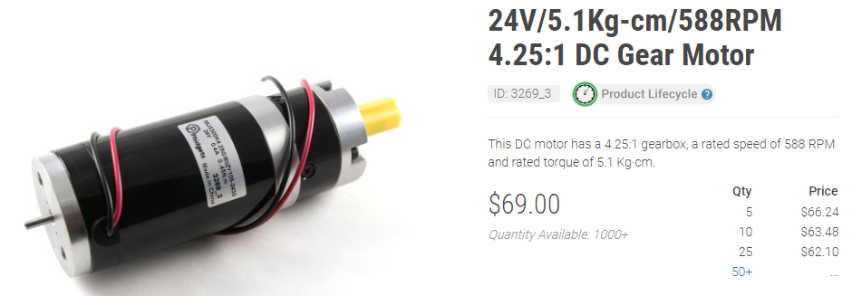

# Boards - standard or micro?

The first choice that we will have to make is which model of GPS receiver we are going to use:&#x20;

Standard: https://www.ardusimple.com/product/simplertk2b/

.png>)

or Micro: [https://www.ardusimple.com/product/simplertk2b-micro/](https://www.ardusimple.com/product/simplertk2b-micro/)

Options : RF connector --------> SMA Form Factor----------> Through hole
