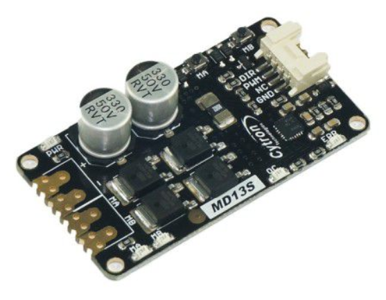

# Which board - standard or micro?

AgOpenGPS boards come in two flavours - Standard or Micro. Functionally, they are the same - they only differ in size. Whether you want single-GPS or dual, either board is fine; and you can simply add another GPS module at a later date if you so wish, no need for another board.

## HOW TO ORDER/BUILD A PCB

We use the JCLPCB service to manufacture our PCBs, but you can use another supplier if you prefer.

1.- Click on [Order Now ](https://cart.jlcpcb.com/quote)to access the page to place the order, and that'll take you to a page that looks like this:

These files are located in AgOpenGPS/Support/TeensyModules/Board and pick either your Micro or Std design. Inside each folder we will find three files that we are going to use, the ZIP file is your Gerber file, so pick that first:

.png>)

It'll process for a bit, and you'll see a summary view:

.png>)

